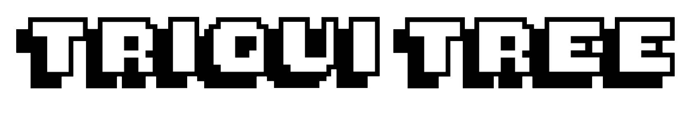

You can play it at [`https://oktuvida.github.io/triqui_tree/`](https://oktuvida.github.io/triqui_tree/) !

*Read this in other languages: [English](README.md), [Español](README.es.md)*.
## Why Tic-tac-toe?
Tic-tac-toe is a game in which two players take turns with each other to draw, usually, "O" or "X" on a board of 9 squares. The winner is the player who has 3 matching symbols in a row, either by rows, columns or diagonals. Its simplicity makes it ideal as a pedagogical target; it is a good start to get into game theory as well as artificial intelligence.
## Why Triqui Tree?
In Colombia, our country of origin, Tic-tac-toe is called "Triqui". "Tree" is simply an allusion to "Game Tree", a somewhat theoretical concept that would be perfect in this context. 
## Why Rust?
Because Rust is life, Rust is love.
## Why WebAssembly?
It's fun to write in Rust, as it is in HTML - CSS - Javascript, why not put them together?
## Development summary
### Game
For its implementation, we start from the structure "triqui", which contains the symbols in game (being characters) and the board (being a vector of characters), as well as its respective constructor concept. initializing the board in the predetermined symbol. To this structure we implemented the interfaces "algorithm", "strategy", and "board".
- The interface "board" implements the interaction with the character vector, performing functions such as search and get a winner.
- The "strategy" interface implements the general scheme that the game should have, such as getting the available game moves, playing and replaying this move, among others.
- The "algorithm" interface implements the decision method that the AI will have. In this case, the recursive Minimax algorithm with alpha-beta pruning was used, which consists of choosing an available move that benefits the AI, by differentiating moves: maximize (convenient for the AI) and minimize (convenient for the player), obviously selecting the former.
### Graphical interface
We start from the "controller" structure, which gives Javascript the information of what will be the next square played by the AI, as well as to verify if a player has already won. Javascript will be in charge of assigning content and styles to the HTML, as well as changing the difficulty of the game by using the browser's session storage.
## Running
### Requirements
- [`Rust`](https://www.rust-lang.org/tools/install)
- [`Node js`](https://nodejs.org/es/download/)
### Compiling
We will suppose that you will have downloaded Rust through [rustup](https://rustup.rs/), if not, you could guide yourself from [here](https://rustwasm.github.io/wasm-pack/book/prerequisites/non-rustup-setups.html). First you must have *wasm-pack*, to do this, open a command prompt and type the following command:

```console
cargo install wasm-pack
```
And that's it, you have everything you need! Go back to the command line and type the following:

``` console
git clone --branch dev https://github.com/Oktuvida/triqui-tree.git
cd triqui-tree
wasm-pack build
cd www/
npm install
npm run start
```
Once this is done, you will be informed on which port you will be able to view the content.

## Licenses
This repository is licensed under [MIT](LICENSE)
